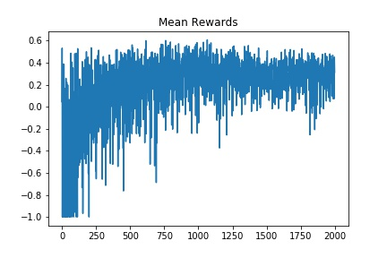

# System Scale Control of Storm Water Networks
Deep Q reinforcement learning algorithm for controlling storm water networks. 

These algorithms operate with the prime directive to maintain the flows in the network below a certain level and avoid flooding the system at any cost.

## Systems controlled

### Single Tank
### Tanks in series

### System Scale Control


```
label["93-49743"] = "C1"
label["93-49868"] = "A1"
label["93-49919"] = "AB2"
label["93-49921"] = "ABC1"
label["93-50074"] = "C2"
label["93-50076"] = "ABC2"
label["93-50077"] = "ABC4"
label["93-50081"] = "ABC3"
label["93-50225"] = "AB1"
label["93-90357"] = "B1"
label["93-90358"] = "A2"
```


## Uncontrolled response

### Tanks in series


### Network response


## Single pond
Classic Q learning[1] was used to train a controller to maintain a constant water level in the pond. Controller has the capability to alter the amount of water released from the pond at every timestep.




## Dependencies
1. matswmm
2. tensorflow
3. keras
4. matplotlib
5. numpy

### References
1. Reinforcement Learning - Sutton and Barto
